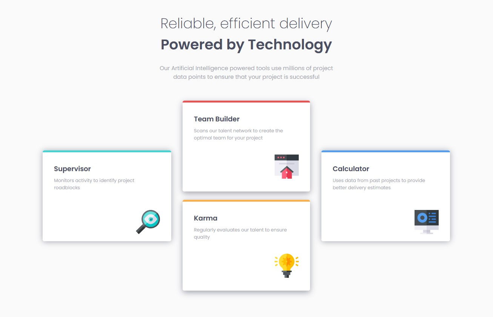

# Frontend Mentor - Four card feature section solution

This is a solution to the [Four card feature section challenge on Frontend Mentor](https://www.frontendmentor.io/challenges/four-card-feature-section-weK1eFYK). Frontend Mentor challenges help you improve your coding skills by building realistic projects. 

### The challenge

Responsive four card feature section.
### Screenshot

### Links

- Solution URL: [Add solution URL here](https://your-solution-url.com)
- Live Site URL: [Add live site URL here](https://your-live-site-url.com)

## My process
Built with html5 & css.

- Semantic HTML5 markup
- CSS custom properties
- Flexbox

### What I learned

Working to further my css skills. This was built primarily with flexbox, however, some portions would be easier to build utilizing Grid.

## Author

- Website - [Rock Hill Video Marketing](https://rockhillvideomarketing.com)
- Frontend Mentor - [@Taddo](https://www.frontendmentor.io/profile/taddo)

